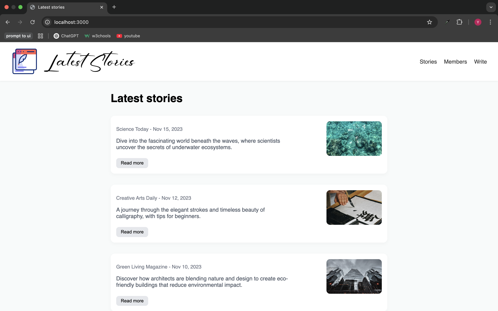

# latest-stories

## Description
latest-stories is a simple Express.js web application that uses EJS templates to render a homepage displaying a collection of sample stories. The app serves static assets from the "public" directory and runs on port 3000.

## Installation
1. Clone the repository or download the source code.
2. Navigate to the project directory.
3. Install the dependencies using npm:

```bash
npm install
```

## Usage
Start the application by running:

```bash
node app.js
```

Open your browser and go to [http://localhost:3000](http://localhost:3000) to view the homepage with the sample stories.

## Project Structure
```
/public          # Static assets (CSS, images)
/views           # EJS templates
app.js           # Main application entry point
package.json     # Project metadata and dependencies
```

## Dependencies
- [Express](https://expressjs.com/) 5.1.0 - Web framework for Node.js
- [EJS](https://ejs.co/) 3.1.10 - Embedded JavaScript templating

## Homepage Preview


## License
This project is licensed under the ISC License.

## Author
<!-- Author information not provided -->
